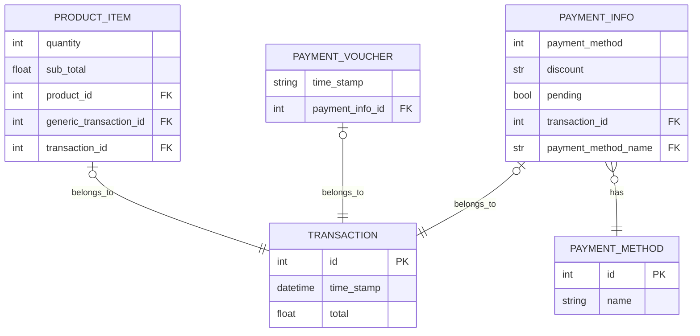

# Project Schema

```mermaid
erDiagram
    TRANSACTION {
        int id PK
        datetime time_stamp
        float total
    }
    PAYMENT_INFO {
        int payment_method
        str discount
        bool pending
        int transaction_id FK
        str payment_method_name FK
    }
    PAYMENT_METHOD {
        int id PK
        string name
    }
    PAYMENT_VOUCHER {
        string time_stamp
        int payment_info_id FK
    }

  
    PAYMENT_INFO |o--|| TRANSACTION: belongs_to
    PAYMENT_INFO }O--|| PAYMENT_METHOD: has
    PAYMENT_VOUCHER |O--|| TRANSACTION: belongs_to

      PRODUCT_ITEM {
        int quantity
        float sub_total
        int product_id FK
        int generic_transaction_id FK
        int transaction_id FK
    }
    PRODUCT_ITEM |o--|| TRANSACTION: belongs_to
```